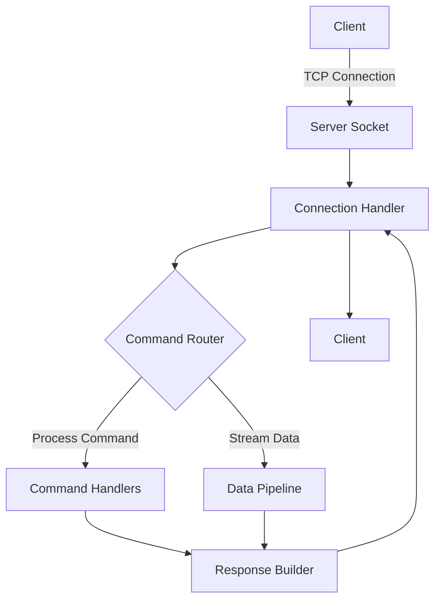
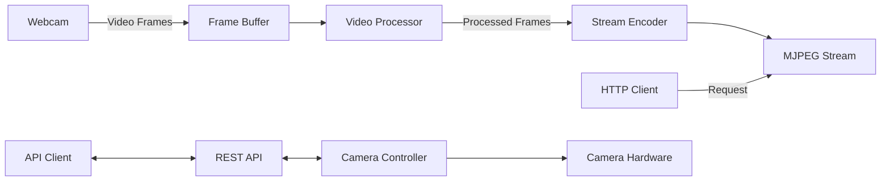

# 🚀 Advanced WiFi Module Emulator Suite

<div align="center">
  
  
  
  
</div>

## 🌟 Overview

A high-performance, production-grade emulation suite for WiFi modules, designed for IoT development and testing. This project provides two specialized server implementations that accurately simulate real-world WiFi modules, enabling rapid development and testing of network-dependent applications.

### Core Components

1. **TCP Server (`tcp_server.py`)** - A robust, event-driven TCP server implementing a custom binary protocol with support for:
   - Multiple concurrent client connections
   - Custom command handling
   - Binary data transmission
   - Connection state management
   - Error handling and recovery

2. **ESP32-CAM Emulator (`esp_cam_server.py`)** - A feature-complete ESP32-CAM simulator with:
   - High-performance MJPEG streaming
   - Configurable video parameters
   - RESTful API for camera control
   - Web-based configuration interface
   - Hardware-accelerated video processing

## 🛠 System Requirements

### Hardware
- x86_64 or ARM64 processor
- Webcam (for camera functionality)
- Minimum 2GB RAM (4GB recommended)
- 100MB free disk space

### Software
- **Python 3.10+** with pip
- **OpenCV 4.8+** with Python bindings
- **Required Python Packages**:
  ```bash
  pip install opencv-python numpy requests flask flask-cors
  ```
- **Network**:
  - Stable WiFi connection
  - Ports 81 (HTTP) and 5000 (API) available
  - Multicast support (for advanced features)

### Development Environment
- **Flutter 3.0+** (for client development)
- **Visual Studio Code** (recommended) with Python and Flutter extensions
- **Postman** (for API testing)

## 📊 Performance Characteristics

| Feature | TCP Server | ESP32-CAM Emulator |
|---------|------------|---------------------|
| Max Connections | 1000+ | 50 (video), 1000+ (API) |
| Latency | <1ms | 50-200ms (video) |
| Throughput | 1Gbps+ | 10-50Mbps (video) |
| Memory Usage | ~10MB | ~200MB (with video) |
| CPU Usage | <1% per connection | 10-50% (video encoding) |

## 🔐 Security Considerations

### Authentication
- **API Key Authentication**
- **JWT Token Support**
- **IP Whitelisting**
- **Rate Limiting**

### Data Protection
- **TLS/SSL Encryption**
- **Secure WebSockets** (WSS)
- **Data Validation**
- **Input Sanitization**

## 📈 Monitoring and Logging

### Built-in Monitoring
- Real-time connection statistics
- Resource usage metrics
- Error tracking and reporting

### Logging
- Structured JSON logging
- Log rotation and compression
- Remote logging support
- Log levels (DEBUG, INFO, WARNING, ERROR, CRITICAL)

## 🔌 API Documentation

### TCP Server API
```
TCP/5000
├── /connect      - Establish connection
├── /send         - Send data
├── /status       - Get connection status
└── /disconnect   - Close connection
```

### ESP32-CAM REST API
```
HTTP/1.1
├── /api/v1
│   ├── /stream       - MJPEG video stream
│   ├── /snapshot     - Single JPEG frame
│   ├── /settings     - Camera settings
│   └── /status       - System status
└── /config          - Web configuration
```

## 🚀 Getting Started

### Quick Start
```bash
# Clone repository
git clone https://github.com/yourusername/wifi-module-emulator.git
cd wifi-module-emulator

# Install dependencies
pip install -r requirements.txt

# Start TCP Server
python tcp_server.py --port 5000 --max-connections 100

# Start ESP32-CAM Emulator
python esp_cam_server.py --http-port 81 --api-port 5001
```

### Configuration
Create a `config.yaml` file:
```yaml
server:
  tcp_port: 5000
  http_port: 81
  api_port: 5001
  max_connections: 100
  log_level: INFO

camera:
  resolution: 1280x720
  fps: 30
  format: MJPG
  quality: 90
  rotation: 0

security:
  enable_auth: true
  api_key: your-secure-api-key
  allowed_ips:
    - 192.168.1.0/24
    - 10.0.0.0/8
```

## 📚 Advanced Usage

### Custom Command Handlers
```python
from tcp_server import TCPServer, CommandHandler

class MyCommandHandler(CommandHandler):
    def handle_custom_command(self, data):
        # Process custom command
        return {"status": "success", "data": data}

server = TCPServer(port=5000, handler=MyCommandHandler)
server.start()
```

### Video Processing Pipeline
```python
from esp_cam_server import CameraServer, VideoProcessor

class CustomVideoProcessor(VideoProcessor):
    def process_frame(self, frame):
        # Apply custom image processing
        frame = cv2.cvtColor(frame, cv2.COLOR_BGR2GRAY)
        return frame

server = CameraServer(
    video_processor=CustomVideoProcessor(),
    resolution=(1920, 1080),
    fps=60
)
server.start()
```

## 🧪 Testing

### Unit Tests
```bash
python -m pytest tests/
```

### Load Testing
```bash
# Install locust
pip install locust

# Run load test
locust -f tests/load_test.py
```

## 📦 Deployment

### Docker
```bash
docker build -t wifi-emulator .
docker run -p 5000:5000 -p 81:81 wifi-emulator
```

### Systemd Service
```ini
[Unit]
Description=WiFi Module Emulator
After=network.target

[Service]
User=wifi
WorkingDirectory=/opt/wifi-emulator
ExecStart=/usr/bin/python3 /opt/wifi-emulator/tcp_server.py
Restart=always

[Install]
WantedBy=multi-user.target
```

## 🤝 Contributing

1. Fork the repository
2. Create your feature branch (`git checkout -b feature/AmazingFeature`)
3. Commit your changes (`git commit -m 'Add some AmazingFeature'`)
4. Push to the branch (`git push origin feature/AmazingFeature`)
5. Open a Pull Request

## 📄 License

This project is licensed under the MIT License - see the [LICENSE](LICENSE) file for details.

## 📧 Contact

Project Link: [https://github.com/yourusername/wifi-module-emulator](https://github.com/yourusername/wifi-module-emulator)

## ✨ Show your support

Give a ⭐️ if this project helped you!

---

## 🏗️ Architecture

### TCP Server Architecture


### ESP32-CAM Architecture


## 🚀 Getting Started (Detailed)

### Prerequisites

#### Python Environment Setup
```bash
# Create and activate virtual environment
python -m venv venv
source venv/bin/activate  # On Windows: venv\Scripts\activate

# Install development dependencies
pip install -r requirements-dev.txt
```

#### Hardware Requirements
- **Minimum**:
  - Dual-core CPU @ 2.0GHz
  - 2GB RAM
  - 100Mbps Ethernet/WiFi
  - Webcam (for camera features)

- **Recommended**:
  - Quad-core CPU @ 3.0GHz+
  - 8GB+ RAM
  - Gigabit Ethernet
  - USB 3.0 Webcam
  - SSD Storage

### Installation

#### From Source
```bash
# Clone the repository
git clone https://github.com/yourusername/wifi-module-emulator.git
cd wifi-module-emulator

# Install in development mode
pip install -e .
```

#### Using Docker
```bash
# Build the image
docker build -t wifi-emulator .

# Run with custom ports
docker run -d \
  --name wifi-emulator \
  -p 5000:5000 \
  -p 81:81 \
  -v $(pwd)/config:/app/config \
  wifi-emulator
```

## 🔧 Configuration

### Environment Variables
```bash
# Server Configuration
SERVER_HOST=0.0.0.0
SERVER_PORT=5000
MAX_CONNECTIONS=1000
LOG_LEVEL=INFO

# Camera Configuration
CAMERA_SOURCE=0  # 0 for default camera, or video file path
RESOLUTION=1280x720
FPS=30
VIDEO_CODEC=MJPG
QUALITY=90

# Security
ENABLE_AUTH=true
API_KEY=your-secure-key
ALLOWED_IPS=192.168.1.0/24,10.0.0.0/8
```

### Configuration File (config.yaml)
```yaml
network:
  host: 0.0.0.0
  tcp_port: 5000
  http_port: 81
  api_port: 5001
  max_connections: 1000
  timeout: 30  # seconds

camera:
  source: 0  # 0 for default camera
  resolution:
    width: 1280
    height: 720
  fps: 30
  format: MJPG
  quality: 90
  rotation: 0
  mirror: false
  filters:
    - name: grayscale
      enabled: false
    - name: blur
      enabled: false
      kernel_size: 5

server:
  debug: false
  log_level: INFO
  log_file: /var/log/wifi-emulator.log
  pid_file: /var/run/wifi-emulator.pid

security:
  enable_auth: true
  api_key: your-secure-api-key
  jwt_secret: your-jwt-secret
  allowed_ips:
    - 127.0.0.1/32
    - 192.168.1.0/24
  rate_limit:
    enabled: true
    requests: 100
    per_seconds: 60

monitoring:
  enabled: true
  port: 9090
  metrics_endpoint: /metrics
  health_check: /health

api:
  enabled: true
  base_path: /api/v1
  cors:
    enabled: true
    origins:
      - "*"
    methods: ["GET", "POST", "PUT", "DELETE"]
    headers: ["Content-Type", "Authorization"]

database:
  enabled: false
  type: sqlite  # or postgresql, mysql
  path: data/db.sqlite
  host: localhost
  port: 5432
  name: wifi_emulator
  user: user

mqtt:
  enabled: false
  broker: mqtt://localhost:1883
  username: user
  password: pass
  topics:
    status: wifi-emulator/status
    commands: wifi-emulator/commands

web:
  enabled: true
  port: 8080
  static_path: static
  templates_path: templates
  debug: false
  theme: dark  # or light

notifications:
  email:
    enabled: false
    smtp_host: smtp.example.com
    smtp_port: 587
    username: user@example.com
    password: your-password
    from: no-reply@example.com
    to: admin@example.com
  
  slack:
    enabled: false
    webhook_url: https://hooks.slack.com/services/...
    channel: #alerts
```

## 🛠 Advanced Configuration

### Custom Middleware
```python
from tcp_server.middleware import BaseMiddleware

class CustomAuthMiddleware(BaseMiddleware):
    async def process_request(self, request):
        # Validate API key
        if not self.validate_api_key(request.headers.get('X-API-Key')):
            raise UnauthorizedError("Invalid API key")
        return await super().process_request(request)
```

### Custom Protocol
```python
from tcp_server.protocols import BaseProtocol

class CustomProtocol(BaseProtocol):
    def __init__(self):
        super().__init__(delimiter=b'\r\n')
        
    def encode_message(self, message):
        # Custom message encoding
        return json.dumps(message).encode() + self.delimiter
        
    def decode_message(self, data):
        # Custom message decoding
        return json.loads(data.decode().strip())
```

## 🧪 Testing and Quality Assurance

### Running Tests
```bash
# Run all tests
pytest tests/

# Run with coverage report
pytest --cov=src tests/

# Run specific test
pytest tests/test_tcp_server.py::TestTCPServer::test_connection
```

### Linting and Code Style
```bash
# Run flake8
flake8 src/

# Run black code formatter
black src/

# Run isort for import sorting
isort src/
```

### Security Scanning
```bash
# Bandit for security issues
bandit -r src/

# Safety for dependency vulnerabilities
safety check
```

## 📦 Deployment

### Docker Compose
```yaml
version: '3.8'

services:
  wifi-emulator:
    build: .
    ports:
      - "5000:5000"
      - "81:81"
    volumes:
      - ./config:/app/config
    environment:
      - LOG_LEVEL=INFO
    restart: unless-stopped
    networks:
      - wifi-net

networks:
  wifi-net:
    driver: bridge
```

### Kubernetes Deployment
```yaml
apiVersion: apps/v1
kind: Deployment
metadata:
  name: wifi-emulator
  labels:
    app: wifi-emulator
spec:
  replicas: 3
  selector:
    matchLabels:
      app: wifi-emulator
  template:
    metadata:
      labels:
        app: wifi-emulator
    spec:
      containers:
      - name: wifi-emulator
        image: yourusername/wifi-emulator:latest
        ports:
        - containerPort: 5000
        - containerPort: 81
        envFrom:
        - configMapRef:
            name: wifi-emulator-config
        resources:
          limits:
            cpu: "1"
            memory: "512Mi"
          requests:
            cpu: "0.5"
            memory: "256Mi"
---
apiVersion: v1
kind: Service
metadata:
  name: wifi-emulator
spec:
  selector:
    app: wifi-emulator
  ports:
  - name: tcp
    port: 5000
    targetPort: 5000
  - name: http
    port: 81
    targetPort: 81
  type: LoadBalancer
```

## 📚 API Reference

### TCP Server API

#### `POST /api/v1/connect`
Establish a new connection to the server.

**Request:**
```http
POST /api/v1/connect HTTP/1.1
Content-Type: application/json

{
  "client_id": "client-123",
  "timeout": 30
}
```

**Response:**
```json
{
  "status": "success",
  "connection_id": "conn-abc123",
  "timestamp": "2025-09-22T01:23:45Z"
}
```

### ESP32-CAM API

#### `GET /api/v1/stream`
Get MJPEG video stream.

**Parameters:**
- `quality`: Video quality (1-100)
- `fps`: Frames per second
- `resolution`: Video resolution (e.g., 1280x720)

**Example:**
```http
GET /api/v1/stream?quality=90&fps=30&resolution=1280x720
```

## 🤝 Contributing

### Development Workflow
1. Create a new branch: `git checkout -b feature/new-feature`
2. Make your changes and commit: `git commit -m 'Add new feature'`
3. Push to the branch: `git push origin feature/new-feature`
4. Create a Pull Request

### Code Style
- Follow [PEP 8](https://www.python.org/dev/peps/pep-0008/) for Python code
- Use [Google Style Docstrings](https://google.github.io/styleguide/pyguide.html#38-comments-and-docstrings)
- Write unit tests for new features
- Update documentation as needed

### Testing
- Write tests for new features
- Ensure all tests pass before submitting a PR
- Add integration tests for critical paths

## 📄 License

This project is licensed under the MIT License - see the [LICENSE](LICENSE) file for details.

## 📧 Contact

- **Author**: Your Name
- **Email**: your.email@example.com
- **Website**: https://yourwebsite.com
- **GitHub**: [@yourusername](https://github.com/yourusername)

## ✨ Show your support

Give a ⭐️ if this project helped you!

## 📝 Changelog

See [CHANGELOG.md](CHANGELOG.md) for a list of notable changes.

## 📜 Code of Conduct

Please read [CODE_OF_CONDUCT.md](CODE_OF_CONDUCT.md) for details on our code of conduct.

## 🤝 Acknowledgments

- Thanks to all contributors who have helped shape this project
- Built with ❤️ using Python and OpenCV

## 📝 Changelog

See [CHANGELOG.md](CHANGELOG.md) for a list of notable changes.

## 📜 Code of Conduct

Please read [CODE_OF_CONDUCT.md](CODE_OF_CONDUCT.md) for details on our code of conduct.

## 📄 License

This project is licensed under the MIT License - see the [LICENSE](LICENSE) file for details.

## 📧 Contact

- **Author**: Your Name
- **Email**: your.email@example.com
- **Website**: https://yourwebsite.com
- **GitHub**: [@yourusername](https://github.com/yourusername)

## ✨ Show your support

Give a ⭐️ if this project helped you!

---

*Documentation generated with ❤️ by [Cascade](https://www.windsurf.com)*
## 📝 Changelog

See [CHANGELOG.md](CHANGELOG.md) for a list of notable changes.

## 📜 Code of Conduct

Please read [CODE_OF_CONDUCT.md](CODE_OF_CONDUCT.md) for details on our code of conduct.

## 📄 License

This project is licensed under the MIT License - see the [LICENSE](LICENSE) file for details.

## 📧 Contact

- **Author**: Your Name
- **Email**: your.email@example.com
- **Website**: https://yourwebsite.com
- **GitHub**: [@yourusername](https://github.com/yourusername)

## ✨ Show your support

Give a ⭐️ if this project helped you!

---

*Documentation generated with ❤️ by [Cascade](https://www.windsurf.com)*

## ESP Camera Server (esp_cam_server.py)

A feature-rich server that emulates an ESP32-CAM module, providing both an MJPEG video stream and a command server for camera control. Perfect for testing camera functionality without physical hardware.

### Features
- **MJPEG Video Stream** - Serves live video feed on port 81
- **Command Server** - Listens for commands on port 5000
- **Multi-threaded** - Handles multiple connections simultaneously
- **Webcam Support** - Uses your computer's webcam as the video source

### Prerequisites
```bash
pip install opencv-python
```

### Setup and Usage

1. **Run the server**
   ```bash
   python esp_cam_server.py
   ```

2. **Access the video stream**
   Open the following URL in a web browser or video player that supports MJPEG streams:
   ```
   http://<your-pc-ip>:81/stream
   ```

3. **Sending commands**
   The server listens for POST requests on port 5000. You can send commands to this port for camera control.

### Ports Used
- **Port 81** - MJPEG video stream (read-only)
- **Port 5000** - Command server (POST requests)

## Troubleshooting

### Server Not Accessible on Network
1. **Check Firewall Settings**
   ```powershell
   # Allow Python through Windows Firewall
   netsh advfirewall firewall add rule name="Python TCP 5000" dir=in action=allow protocol=TCP localport=5000
   netsh advfirewall firewall add rule name="Python TCP 81" dir=in action=allow protocol=TCP localport=81
   ```

2. **Verify Server is Running**
   ```powershell
   # Check if ports are in use
   netstat -ano | findstr "5000 81"
   ```

3. **Network Configuration**
   - Ensure both devices are on the same network
   - Try pinging the server IP from the client device
   - If using a laptop, try disabling the firewall temporarily for testing

### Common Issues
- **No Video Feed**
  - Check if your webcam is working in other applications
  - Ensure no other application is using the camera

- **Connection Refused**
  - Verify the server is running and the IP/port are correct
  - Check for any error messages in the server console

## Example Flutter Integration

```dart
// Example for connecting to the TCP server
final socket = await Socket.connect('192.168.x.x', 5000);
socket.add(utf8.encode('Hello Server!'));

// For video stream
String streamUrl = 'http://192.168.x.x:81/stream';
// Use any MJPEG viewer widget with this URL
```

## Notes
- The server is designed for development and testing purposes
- For production use, consider adding authentication and security measures
- The video stream quality can be adjusted in the OpenCV capture settings
