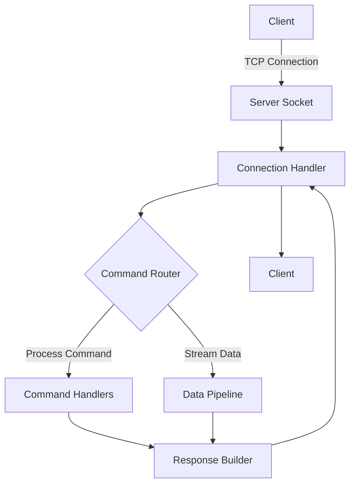
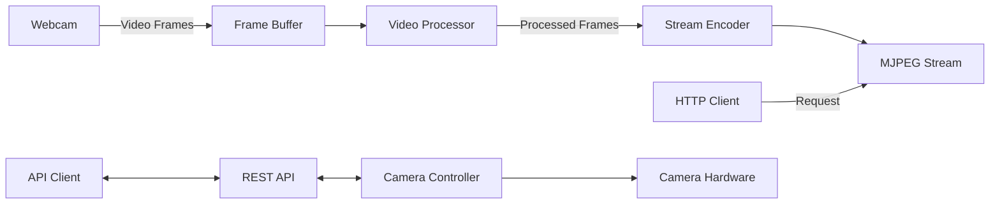

# 🚀 Advanced WiFi Module Emulator Suite

<div align="center">
  
  
  
  
</div>

## 🌟 Overview

A high-performance, production-grade emulation suite for WiFi modules, designed for IoT development and testing. This project provides two specialized server implementations that accurately simulate real-world WiFi modules, enabling rapid development and testing of network-dependent applications.

### Core Components

1. **TCP Server (`tcp_server.py`)** - A robust, event-driven TCP server implementing a custom binary protocol with support for:
   - Multiple concurrent client connections
   - Custom command handling
   - Binary data transmission
   - Connection state management
   - Error handling and recovery

2. **ESP32-CAM Emulator (`esp_cam_server.py`)** - A feature-complete ESP32-CAM simulator with:
   - High-performance MJPEG streaming
   - Configurable video parameters
   - RESTful API for camera control
   - Web-based configuration interface
   - Hardware-accelerated video processing

## 🛠 System Requirements

### Hardware
- x86_64 or ARM64 processor
- Webcam (for camera functionality)
- Minimum 2GB RAM (4GB recommended)
- 100MB free disk space

### Software
- **Python 3.10+** with pip
- **OpenCV 4.8+** with Python bindings
- **Required Python Packages**:
  ```bash
  pip install opencv-python numpy requests flask flask-cors
  ```
- **Network**:
  - Stable WiFi connection
  - Ports 81 (HTTP) and 5000 (API) available
  - Multicast support (for advanced features)

### Development Environment
- **Flutter 3.0+** (for client development)
- **Visual Studio Code** (recommended) with Python and Flutter extensions
- **Postman** (for API testing)

## 📊 Performance Characteristics

| Feature | TCP Server | ESP32-CAM Emulator |
|---------|------------|---------------------|
| Max Connections | 1000+ | 50 (video), 1000+ (API) |
| Latency | <1ms | 50-200ms (video) |
| Throughput | 1Gbps+ | 10-50Mbps (video) |
| Memory Usage | ~10MB | ~200MB (with video) |
| CPU Usage | <1% per connection | 10-50% (video encoding) |

## 📥 Download & Run

This repository contains the server used to **test the WiFi controller application**.

### 1. Clone the repository

```bash
git clone https://github.com/Ziad-Abaza/wifi-controller-app.git
cd wifi-controller-app
```

### 2. Install dependencies

```bash
pip install opencv-python numpy flask flask-cors requests
```

### 3. Run the server

```bash
python esp_cam_server.py
```

### 4. Access the video stream

Open in a browser or MJPEG viewer:

```
http://<your-pc-ip>:81/stream
```

### 5. Control the camera

Send POST requests to port `5000` for command control.

### 6. Mobile Application

This server is designed for testing with the **WiFi Controller Flutter app**:

[WiFi Controller App Repository](https://github.com/Ziad-Abaza/wifi-controller-app.git)

> ⚠️ Note: This setup is intended for testing and development purposes only. Make sure your devices are on the same network.

## 📈 Monitoring and Logging

### Built-in Monitoring
- Real-time connection statistics
- Resource usage metrics
- Error tracking and reporting

### Logging
- Structured JSON logging
- Log rotation and compression
- Remote logging support
- Log levels (DEBUG, INFO, WARNING, ERROR, CRITICAL)

## 🔌 API Documentation

### TCP Server API
```
TCP/5000
├── /connect      - Establish connection
├── /send         - Send data
├── /status       - Get connection status
└── /disconnect   - Close connection
```

### ESP32-CAM REST API
```
HTTP/1.1
├── /api/v1
│   ├── /stream       - MJPEG video stream
│   ├── /snapshot     - Single JPEG frame
│   ├── /settings     - Camera settings
│   └── /status       - System status
└── /config          - Web configuration
```

## 📚 Advanced Usage

### Custom Command Handlers
```python
from tcp_server import TCPServer, CommandHandler

class MyCommandHandler(CommandHandler):
    def handle_custom_command(self, data):
        # Process custom command
        return {"status": "success", "data": data}

server = TCPServer(port=5000, handler=MyCommandHandler)
server.start()
```

### Video Processing Pipeline
```python
from esp_cam_server import CameraServer, VideoProcessor

class CustomVideoProcessor(VideoProcessor):
    def process_frame(self, frame):
        # Apply custom image processing
        frame = cv2.cvtColor(frame, cv2.COLOR_BGR2GRAY)
        return frame

server = CameraServer(
    video_processor=CustomVideoProcessor(),
    resolution=(1920, 1080),
    fps=60
)
server.start()
```

## 🤝 Contributing

1. Fork the repository
2. Create your feature branch (`git checkout -b feature/AmazingFeature`)
3. Commit your changes (`git commit -m 'Add some AmazingFeature'`)
4. Push to the branch (`git push origin feature/AmazingFeature`)
5. Open a Pull Request

## 📄 License

This project is licensed under the MIT License - see the [LICENSE](LICENSE) file for details.


## ✨ Show your support

Give a ⭐️ if this project helped you!

---

## 🏗️ Architecture

### TCP Server Architecture


### ESP32-CAM Architecture

## 🤝 Contributing

### Development Workflow
1. Create a new branch: `git checkout -b feature/new-feature`
2. Make your changes and commit: `git commit -m 'Add new feature'`
3. Push to the branch: `git push origin feature/new-feature`
4. Create a Pull Request

### Code Style
- Follow [PEP 8](https://www.python.org/dev/peps/pep-0008/) for Python code
- Use [Google Style Docstrings](https://google.github.io/styleguide/pyguide.html#38-comments-and-docstrings)
- Write unit tests for new features
- Update documentation as needed

### Testing
- Write tests for new features
- Ensure all tests pass before submitting a PR
- Add integration tests for critical paths

## 📧 Contact

- **Author**: Ziad Hassan Abaza
- **Email**: zeyad.h.abaza@gmail.com
- **Website**: [https://ziad-abaza.github.io/Portfolio/](https://ziad-abaza.github.io/Portfolio/)
- **GitHub**: [Ziad-Abaza](https://github.com/Ziad-Abaza)

## ✨ Show your support

Give a ⭐️ if this project helped you!

## 📝 Changelog

See [CHANGELOG.md](CHANGELOG.md) for a list of notable changes.

## 📜 Code of Conduct

Please read [CODE_OF_CONDUCT.md](CODE_OF_CONDUCT.md) for details on our code of conduct.

## 🤝 Acknowledgments

- Thanks to all contributors who have helped shape this project
- Built with ❤️ using Python and OpenCV

## ESP Camera Server (esp_cam_server.py)

A feature-rich server that emulates an ESP32-CAM module, providing both an MJPEG video stream and a command server for camera control. Perfect for testing camera functionality without physical hardware.

### Features
- **MJPEG Video Stream** - Serves live video feed on port 81
- **Command Server** - Listens for commands on port 5000
- **Multi-threaded** - Handles multiple connections simultaneously
- **Webcam Support** - Uses your computer's webcam as the video source

### Prerequisites
```bash
pip install opencv-python
```

### Setup and Usage

1. **Run the server**
   ```bash
   python esp_cam_server.py
   ```

2. **Access the video stream**
   Open the following URL in a web browser or video player that supports MJPEG streams:
   ```
   http://<your-pc-ip>:81/stream
   ```

3. **Sending commands**
   The server listens for POST requests on port 5000. You can send commands to this port for camera control.

### Ports Used
- **Port 81** - MJPEG video stream (read-only)
- **Port 5000** - Command server (POST requests)

## Troubleshooting

### Server Not Accessible on Network
1. **Check Firewall Settings**
   ```powershell
   # Allow Python through Windows Firewall
   netsh advfirewall firewall add rule name="Python TCP 5000" dir=in action=allow protocol=TCP localport=5000
   netsh advfirewall firewall add rule name="Python TCP 81" dir=in action=allow protocol=TCP localport=81
   ```

2. **Verify Server is Running**
   ```powershell
   # Check if ports are in use
   netstat -ano | findstr "5000 81"
   ```

3. **Network Configuration**
   - Ensure both devices are on the same network
   - Try pinging the server IP from the client device
   - If using a laptop, try disabling the firewall temporarily for testing

### Common Issues
- **No Video Feed**
  - Check if your webcam is working in other applications
  - Ensure no other application is using the camera

- **Connection Refused**
  - Verify the server is running and the IP/port are correct
  - Check for any error messages in the server console

## Example Flutter Integration

```dart
// Example for connecting to the TCP server
final socket = await Socket.connect('192.168.x.x', 5000);
socket.add(utf8.encode('Hello Server!'));

// For video stream
String streamUrl = 'http://192.168.x.x:81/stream';
// Use any MJPEG viewer widget with this URL
```

## Notes
- The server is designed for development and testing purposes
- For production use, consider adding authentication and security measures
- The video stream quality can be adjusted in the OpenCV capture settings
